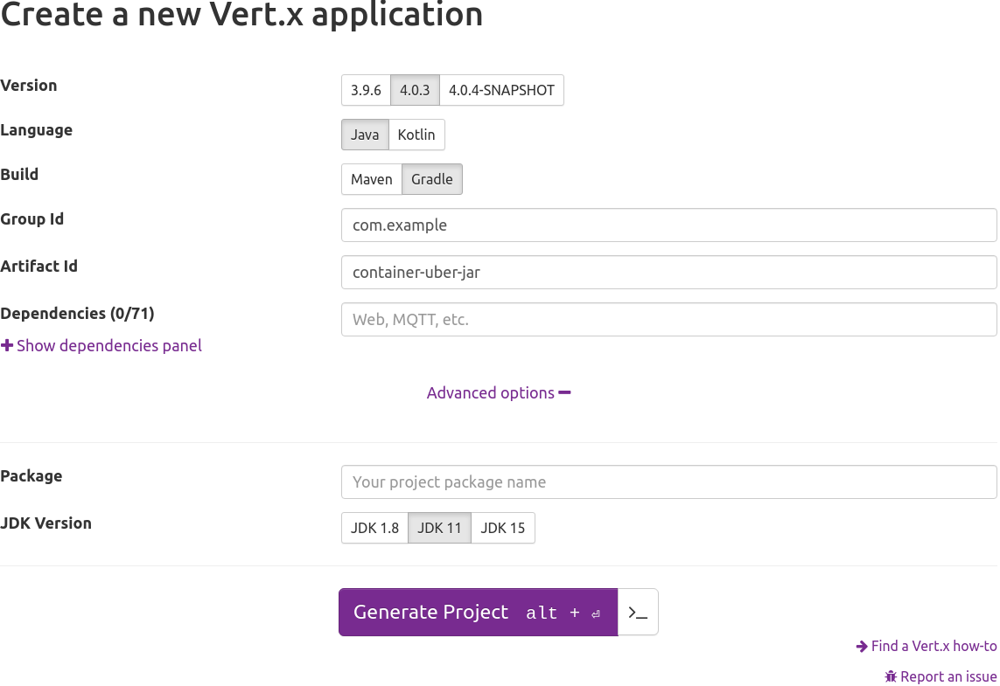

= Creating a container for a Vert.x app packaged as an executable uber-jar
:page-permalink: /
:page-github: vertx-howtos/executable-jar-docker-howto

ifdef::env-github[]
image:https://github.com/vertx-howtos/executable-jar-docker-howto/actions/workflows/publish.yml/badge.svg["Publish the how-to", link="https://github.com/vertx-howtos/executable-jar-docker-howto/actions/workflows/publish.yml"]
endif::env-github[]

== What you will create

You will create a container for a Vert.x app packaged as an executable https://stackoverflow.com/a/11947093/2133695[_uber-jar_].

The how-to consists in a couple of files:

. the `docker-maven/Dockerfile`, for Maven users, or
. the `docker-gradle/Dockerfile`, for Gradle users.

== What you need

* A text editor or IDE
* Docker

== Using Maven

=== Generate the project

First, generate the project from https://start.vertx.io:

. Select the `Maven` build type
. Set the `artifactId` to `container-uber-jar`
. Select the `JDK 11` JDK version
. Click on generate and extract the content somewhere on your disk

Alternatively, open a terminal and run:

[source,bash]
----
curl -G https://start.vertx.io/starter.zip -d "artifactId=container-uber-jar" -d "jdkVersion=11" -d "buildTool=maven" --output container-uber-jar.zip
unzip container-uber-jar.zip
----

Or, with HTTPie:

[source,bash]
----
http https://start.vertx.io/starter.zip artifactId==container-uber-jar jdkVersion==11 buildTool==maven --output container-uber-jar.zip
unzip container-uber-jar.zip
----

=== Configuring the Docker build

At the root of the project, create a `docker-maven/Dockerfile` build file:

ifdef::env-github[]
link:docker-maven/Dockerfile[Docker build file for a Maven project]
endif::env-github[]
ifndef::env-github[]
[source,dockerfile]
.Docker build file for a Maven project
----
include::docker-maven/Dockerfile[]
----
endif::env-github[]

The Docker build has two stages:

. Building the Maven project inside a `maven:3.6.3-openjdk-11` container
. Copying the output of the build in a `adoptopenjdk:11-jre-hotspot` container and configuring the entry point

The benefits of this approach are:

- reproducible build: no matter who in the team runs the Docker build, it will always use the same Maven version and JDK version (both at build-time and run-time)
- small container image size: the final container will be based on a slim JDK image and will only add the uber-jar file

To build the container, open a terminal at the root of the project and run:

[source,bash]
----
docker build -t com.example/container-uber-jar -f docker-maven/Dockerfile .
----

== Using Gradle

=== Generate the project

First, generate the project from https://start.vertx.io:

. Select the `Gradle` build type
. Set the `artifactId` to `container-uber-jar`
. Select the `JDK 11` JDK version
. Click on generate and extract the content somewhere on your disk

Alternatively, open a terminal and run:

[source,bash]
----
curl -G https://start.vertx.io/starter.zip -d "artifactId=container-uber-jar" -d "jdkVersion=11" -d "buildTool=gradle" --output container-uber-jar.zip
unzip container-uber-jar.zip
----

Or, with HTTPie:

[source,bash]
----
http https://start.vertx.io/starter.zip artifactId==container-uber-jar jdkVersion==11 buildTool==gradle --output container-uber-jar.zip
unzip container-uber-jar.zip
----

=== Configuring the Docker build

At the root of the project, create a `docker-gradle/Dockerfile` build file:

ifdef::env-github[]
link:docker-gradle/Dockerfile[Docker build file for a Gradle project]
endif::env-github[]
ifndef::env-github[]
[source,dockerfile]
.Docker build file for a Gradle project
----
include::docker-gradle/Dockerfile[]
----
endif::env-github[]

The Docker build has two stages:

. Building the Gradle project inside a `gradle:6.8.3-jdk11` container
. Copying the output of the build in a `adoptopenjdk:11-jre-hotspot` container and configuring the entry point

The benefits of this approach are:

- reproducible build: no matter who in the team runs the Docker build, it will always use the same Gradle version and JDK version (both at build-time and run-time)
- small container image size: the final container will be based on a slim JDK image and will only add the uber-jar file

To build the container, open a terminal at the root of the project and run:

[source,bash]
----
docker build -t com.example/container-uber-jar -f docker-gradle/Dockerfile .
----

== Running the application

Now that you have built the container image, it is time to try it out!

Open a terminal and run:

[source,bash]
----
docker run -p 8888:8888 com.example/container-uber-jar
----

You should see messages like these on the console output:

----
HTTP server started on port 8888
Mar 16, 2021 2:45:57 PM io.vertx.core.impl.launcher.commands.VertxIsolatedDeployer
INFO: Succeeded in deploying verticle
----

Then browse to http://localhost:8888 and get your greeting from the Vert.x app running in the container!

== Summary

This document covered:

. configuring a Docker build for Maven users,
. configuring a Docker build for Gradle users.

== See also

- https://docs.docker.com/engine/reference/builder/[Dockerfile reference]
- https://docs.docker.com/develop/develop-images/multistage-build/[Multi-stage builds introduction]
